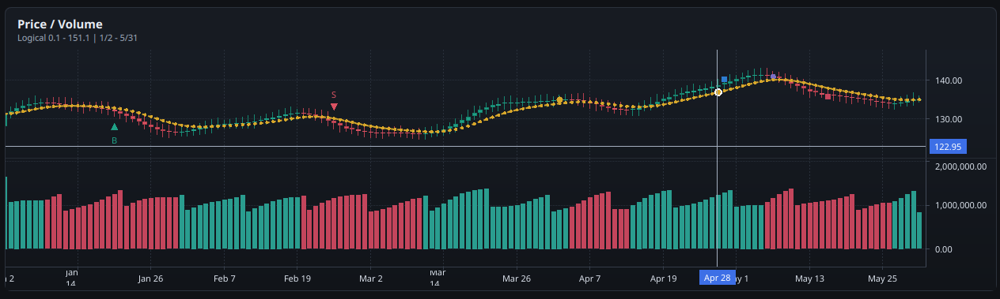
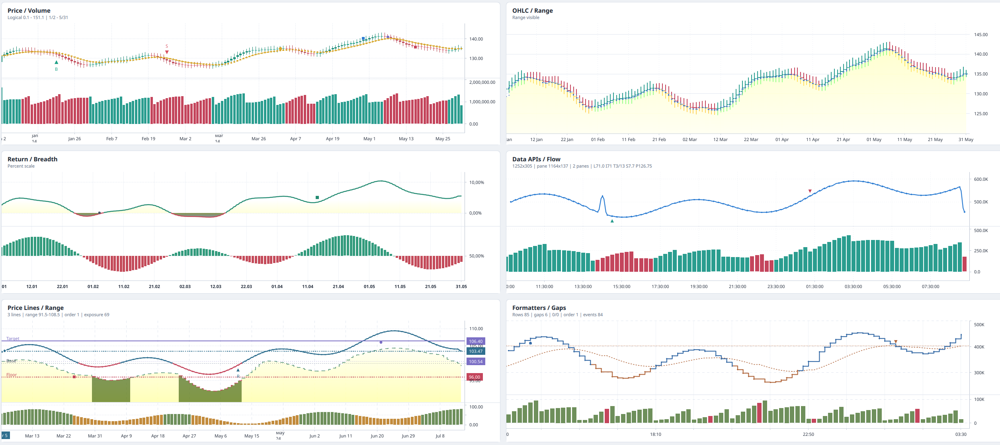

# QtFinCharts

QtFinCharts is a native Qt 6 / Qt Quick financial chart library for QML and C++
applications. It provides financial charts through
Qt-native APIs and Qt Quick Scene Graph rendering: charts, panes, time scales,
price scales, candlesticks, line-like series, histograms, markers, crosshair
labels, themes, formatters, and interaction handling.



## Highlights

- QML module: `import QtFinCharts`
- CMake package target: `QtFinCharts::QtFinCharts`
- Minimum Qt: 6.5
- Language level: C++20
- Rendering: custom `QQuickItem` with Qt Quick Scene Graph nodes
- Series: candlestick, bar, line, area, baseline, histogram
- Scales: shared time scale, right/left price scales, overlay price scales,
  logarithmic, percentage, indexed-to-100, inverted, manual, and auto-scale
- Interaction: pan, zoom, touch drag, pinch, crosshair, pane resize, axis reset
- Data flow: `setData()`, incremental `update()`, historical updates,
  whitespace rows, `data()`, `dataByIndex()`, and `barsInLogicalRange()`

## Requirements

Install:

- CMake 3.24 or newer
- Qt 6.5 or newer with `Core`, `Gui`, `Qml`, and `Quick`
- A C++20 compiler supported by your Qt kit

On a typical Qt online-installer layout, pass the Qt kit prefix to CMake:

```sh
cmake -S . -B build/release \
  -DCMAKE_BUILD_TYPE=Release \
  -DCMAKE_PREFIX_PATH=/path/to/Qt/6.x/<kit>
```

Examples of kit prefixes are `~/Qt/6.8.3/macos`, `~/Qt/6.8.3/gcc_64`, or
`C:/Qt/6.8.3/msvc2022_64`.

## Build

For day-to-day development:

```sh
cmake --preset dev
cmake --build --preset dev
```

For a release-style build and install:

```sh
cmake --preset release
cmake --build --preset release
cmake --install build/release --prefix /path/to/install
```

If you do not use presets:

```sh
cmake -S . -B build \
  -DCMAKE_BUILD_TYPE=Release \
  -DQTFINCHARTS_BUILD_EXAMPLES=ON \
  -DQTFINCHARTS_INSTALL=ON
cmake --build build --parallel
cmake --install build --prefix /path/to/install
```

## CMake Options

| Option | Default | Description |
| --- | --- | --- |
| `QTFINCHARTS_BUILD_EXAMPLES` | `ON` for top-level builds, `OFF` as a subproject | Build the basic and showcase example apps. |
| `QTFINCHARTS_INSTALL` | `ON` for top-level builds, `OFF` as a subproject | Generate install rules and CMake package files. |
| `QTFINCHARTS_LIBRARY_TYPE` | empty | Set to `STATIC` or `SHARED`, or leave empty to follow CMake defaults. |
| `QTFINCHARTS_QT_MIN_VERSION` | `6.5` | Minimum Qt version requested by `find_package(Qt6 ...)`. |
| `QTFINCHARTS_INSTALL_QMLDIR` | `${CMAKE_INSTALL_LIBDIR}/qml` | Install location for generated QML module metadata and plugin files. |

## Use From An Installed Package

After installing QtFinCharts, consume it like a normal CMake package:

```cmake
find_package(Qt6 6.5 REQUIRED COMPONENTS Core Gui Qml Quick)
find_package(QtFinCharts 0.1 CONFIG REQUIRED)

qt_add_executable(MyApp
    main.cpp
)

qt_add_qml_module(MyApp
    URI MyApp
    VERSION 1.0
    QML_FILES
        Main.qml
)

target_link_libraries(MyApp
    PRIVATE
        Qt6::Quick
        QtFinCharts::QtFinCharts
)

qt_import_qml_plugins(MyApp)
```

Then import the QML module:

```qml
import QtQuick
import QtFinCharts

Window {
    width: 1000
    height: 640
    visible: true

    FinancialChart {
        id: chart
        anchors.fill: parent

        CandlestickSeries {
            id: candles
        }

        Component.onCompleted: {
            candles.setData([
                { time: 1704153600, open: 100, high: 104, low: 98, close: 102 },
                { time: 1704240000, open: 102, high: 106, low: 101, close: 105 }
            ])
            chart.fitContent()
        }
    }
}
```

For dynamic QML-module deployments, make sure the installed QML directory is in
the engine import path. During local development, that can be as simple as:

```sh
export QML_IMPORT_PATH=/path/to/install/lib/qml
```

Application deployment should use Qt's deployment tooling for your platform.

## Use With FetchContent Or add_subdirectory

QtFinCharts behaves as a quiet subproject by default: examples and install rules
are off unless you enable them.

```cmake
include(FetchContent)

FetchContent_Declare(
    QtFinCharts
    GIT_REPOSITORY https://github.com/h2337/QtFinCharts.git
    GIT_TAG v0.1.0
)
FetchContent_MakeAvailable(QtFinCharts)

target_link_libraries(MyApp PRIVATE QtFinCharts::QtFinCharts)
qt_import_qml_plugins(MyApp)
```

When using a static Qt or a static QtFinCharts build, keep
`qt_import_qml_plugins(MyApp)` after linking so Qt can import the generated QML
plugin initialization target.

## C++ Headers

The umbrella header is:

```cpp
#include <QtFinCharts/QtFinCharts.h>
```

You can also include focused headers from the installed package, for example:

```cpp
#include <QtFinCharts/quick/FinancialChartItem.h>
#include <QtFinCharts/core/TimeScale.h>
```

Most application code should prefer the QML API. The C++ core classes under
`core/` are public because they are useful for embedding and advanced
integration.

## QML API Overview

The top-level item is `FinancialChart`. Series are declared as child objects:

```qml
FinancialChart {
    paneCount: 2
    pricePrecision: 2
    priceScaleMode: "normal"

    CandlestickSeries {
        id: price
        name: "Price"
    }

    HistogramSeries {
        id: volume
        name: "Volume"
        pane: 1
        baseValue: 0
    }
}
```

### Series Types

| QML type | Data fields | Typical use |
| --- | --- | --- |
| `CandlestickSeries` | `time`, `open`, `high`, `low`, `close` | OHLC candles with body and wicks. |
| `BarSeries` | `time`, `open`, `high`, `low`, `close` | OHLC bars. |
| `LineSeries` | `time`, `value` | Indicators, averages, and single-value data. |
| `AreaSeries` | `time`, `value` | Filled value series. |
| `BaselineSeries` | `time`, `value` | Value series split around `baseValue`. |
| `HistogramSeries` | `time`, `value` | Volume and column-style data. |

All series support common properties such as `name`, `title`, `pane`,
`priceScaleId`, `visible`, `lastValueLabelVisible`, `priceLineVisible`,
`priceLineColor`, `priceLineWidth`, `baseLineVisible`, `hitTestTolerance`, and
`dataConflationThreshold`.

### Data Rows

`time` accepts UTC seconds, Qt date/time values, business-day strings, and
business-day objects. Numeric prices must be finite.

```qml
candles.setData([
    { time: "2024-01-02", open: 101, high: 104, low: 99, close: 103 },
    { time: "2024-01-03", open: 103, high: 106, low: 102, close: 105 }
])

line.update({ time: 1704326400, value: 104.25 })
line.update({ time: 1704153600, value: 102.75 }, true) // historical update
```

A row with a valid `time` and no value fields is treated as whitespace. It
extends the shared timeline without drawing a data point or contributing to
autoscale.

### Markers And Price Lines

```qml
candles.setMarkers([
    {
        id: "entry",
        time: "2024-01-05",
        position: "belowBar",
        shape: "arrowUp",
        color: "#26a69a",
        text: "B"
    }
])

const lineId = candles.createPriceLine({
    price: 105.5,
    title: "Target",
    color: "#f2c94c",
    lineStyle: 2
})
```

### Panes And Price Scales

Use `pane` to place a series on a pane. Use `priceScaleId` to attach a series to
the right scale, left scale, or a named hidden overlay scale.

```qml
FinancialChart {
    paneCount: 2
    leftPriceScaleVisible: true

    CandlestickSeries {
        id: price
        priceScaleId: "right"
    }

    LineSeries {
        id: relativeStrength
        priceScaleId: "left"
        color: "#5b8cce"
    }

    HistogramSeries {
        id: overlayVolume
        priceScaleId: "volume"
        color: "#335b8cce"
    }
}
```

Pane helpers include `addPane()`, `removePane(index)`, `swapPanes(first, second)`,
`setPaneHeight(pane, height)`, `setPaneStretchFactor(pane, factor)`,
`moveSeriesToPane(series, pane, visualIndex)`, and `paneSizes()`.

Price range helpers include `visiblePriceRange(pane)`,
`visiblePriceRangeForScale(id, pane)`, `setVisiblePriceRange(...)`, and
`clearVisiblePriceRange(...)`.

### Time Scale And Coordinate Helpers

Useful chart methods include:

- `fitContent()` and `resetTimeScale()`
- `visibleLogicalRange()` and `setVisibleLogicalRange(from, to)`
- `visibleTimeRange()` and `setVisibleTimeRange(from, to)`
- `logicalToCoordinate(index)` and `coordinateToLogical(x)`
- `timeToCoordinate(time)` and `coordinateToTime(x)`
- `scrollPosition()`, `scrollToPosition(position)`, and `scrollToRealTime()`
- `priceToCoordinate(pane, price)`
- `coordinateToData(point)`
- `saveScreenshot(fileName, targetSize)`

Signals include `crosshairMoved(payload)`, `clicked(payload)`,
`doubleClicked(payload)`, `visibleLogicalRangeChanged(range)`,
`visibleTimeRangeChanged(range)`, and `timeScaleSizeChanged(width, height)`.

### Themes And Formatting

Define a `ChartTheme` and assign it to `FinancialChart.theme`:

```qml
ChartTheme {
    id: darkTheme
    backgroundColor: "#111318"
    textColor: "#d6d8df"
    gridColor: "#242934"
    crosshairColor: "#9aa4ba"
    crosshairLabelBackground: "#2962ff"
}

FinancialChart {
    theme: darkTheme
    localeName: "en_US"
    pricePrecision: 2
    timeVisible: false
    dateFormat: "MMM d"
}
```

Formatter hooks such as `timeFormatter`, `timeTickMarkFormatter`,
`priceFormatter`, `percentageFormatter`, `priceTickMarkFormatter`, and
`percentageTickMarkFormatter` accept QML JavaScript callbacks.

## Examples

Build with `QTFINCHARTS_BUILD_EXAMPLES=ON`, then run:

- `QtFinChartsBasic`: compact chart with price, indicators, volume, markers, and
  panes.
- `QtFinChartsShowcase`: broader interactive showcase covering series types,
  panes, range controls, crosshair sync, custom formatting, and live updates.

## Repository Layout

```text
src/qtfincharts/core/      Chart model, time scale, price scale, data models
src/qtfincharts/quick/     QML-facing types and Qt Quick Scene Graph renderer
examples/basic/            Small runnable QML example
examples/showcase/         Larger interactive example
```

## Design Notes

The C++ core avoids QML dependencies where practical so scale math, timeline
merging, autoscale behavior, update semantics, and pane layout stay independent
from any window. The QML layer owns input events, scene graph updates, text
textures, hit testing, and chart item lifecycle.

## License

MIT
[`LICENSE.md`](LICENSE.md).
